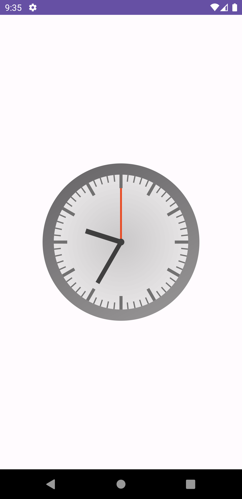

# JetClo
`JetClo` is a simple customizable analog clock for `Jetpack Compose`.

*The library is not yet fully completed, especially in terms of customization. Feel free to contribute to the library.

## Screenshoot


## Installation
### Gradle
Make sure that the repositories section includes the following:
```gradle
repositories {
    maven { url 'https://jitpack.io' }
}
```
Also on your module's build.gradle file add this implementation statement to the dependencies section:
```gradle
dependencies {
    implementation 'com.github.hib4:jetclo:1.0.3'
}
```

## Usage
### Basic
`JetCloExample` is an example of using `JetClo` in Jetpack Compose. It displays an analog clock view that continuously updates the current time every second.
The variable `currentTime` uses `remember` to store the current time, and `LaunchedEffect` updates this value every second.
```kotlin
@Composable
fun JetCloExample() {
    var currentTime by remember {
        mutableStateOf(System.currentTimeMillis())
    }

    LaunchedEffect(key1 = true) {
        while (true) {
            delay(1000)
            currentTime = System.currentTimeMillis()
        }
    }

    JetClo(
        modifier = Modifier.size(500.dp),
        circleRadius = 300f,
        outerCircleThickness = 50f,
        time = {
            currentTime
        }
    )
}
```

## License
```
Copyright (c) 2023 Hibatullah Fawwaz Hana

Permission is hereby granted, free of charge, to any person obtaining a copy
of this software and associated documentation files (the "Software"), to deal
in the Software without restriction, including without limitation the rights
to use, copy, modify, merge, publish, distribute, sublicense, and/or sell
copies of the Software, and to permit persons to whom the Software is
furnished to do so, subject to the following conditions:

The above copyright notice and this permission notice shall be included in all
copies or substantial portions of the Software.

THE SOFTWARE IS PROVIDED "AS IS", WITHOUT WARRANTY OF ANY KIND, EXPRESS OR
IMPLIED, INCLUDING BUT NOT LIMITED TO THE WARRANTIES OF MERCHANTABILITY,
FITNESS FOR A PARTICULAR PURPOSE AND NONINFRINGEMENT. IN NO EVENT SHALL THE
AUTHORS OR COPYRIGHT HOLDERS BE LIABLE FOR ANY CLAIM, DAMAGES OR OTHER
LIABILITY, WHETHER IN AN ACTION OF CONTRACT, TORT OR OTHERWISE, ARISING FROM,
OUT OF OR IN CONNECTION WITH THE SOFTWARE OR THE USE OR OTHER DEALINGS IN THE
SOFTWARE.
```
